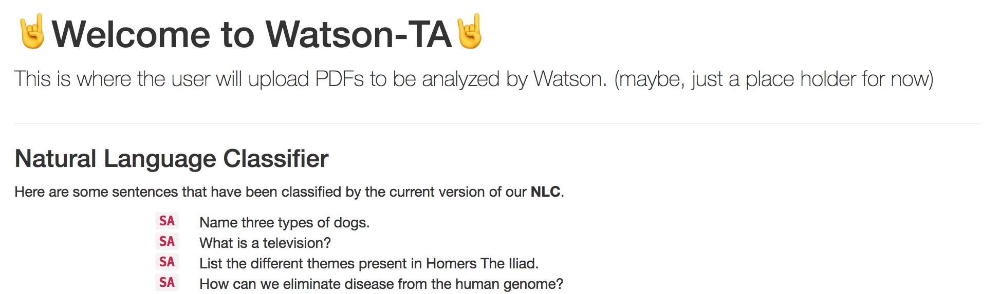

# Watson-TA
[](https://travis-ci.org/signofthehorns/watson-ta)

<!-- TOC depthFrom:2 -->

- [What is Watson TA](#what-is-watson-ta)
- [Setup](#setup)
- [The Team](#the-team)

<!-- /TOC -->

## What is Watson TA

We plan on making the Watson TA. It will be a web app where students can upload a school assignment (homework, quiz, test, etc.) and Watson will tell the student if his/her answer is correct or not, give its own top 2 or 3 answers, and allow the student to drag and drop his/her favorite answer if the student wishes to take one of the suggested ones.

Extensions:
- Add 24/7 office hour TA so students can ask questions if they don't understand the suggested answers.

## Setup

1. Clone this repository
2. Set ENV variables for:
  ```BASH
  # For the Watson natural-language-classifier NLC
  export watson_username
  export watson_password
  ```
  
3. Navagate into the `.../watson-ta/` directory
3. Make sure the following is installed:
  - Python 2
  - pip
  - npm
  
4. Setup the virtual python environment:
  ```BASH
  source bin/activate
  pip install -r requirements.txt
  ```
  
5. Setup the npm environment:
  ```BASH
  npm install
  ```
  
6. Run the app with:
  ```BASH
  python www/manage.py runserver
  ```
  
7. Open the app at `localhost:8000/pdfupload/` the following should appear:

  

## The Team

- Team: **Sign of the Horns (aka |..|,)**
- Members:
  - Dalton Flanagan
  - Liv Stanley
  - Bill Varcho
  - Tyler Zeller
  - David Soller


